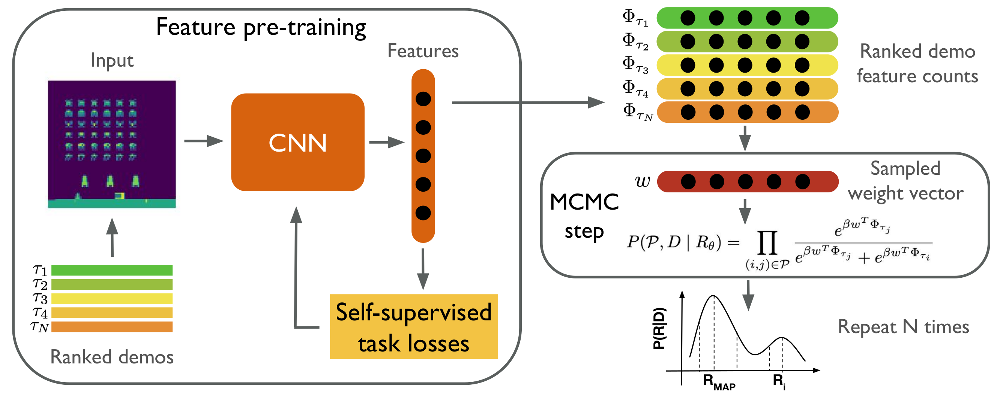

# Safe Imitation Learning via Fast Bayesian Reward Inference from Preferences

Daniel S. Brown, Russell Coleman, Ravi Srinivasan, Scott Niekum

<p align="center">
  <a href="https://arxiv.org/abs/2002.09089">View on ArXiv</a> |
  <a href="https://sites.google.com/view/bayesianrex/">Project Website</a>
</p>


<p align=center>
  
</p>


This repository contains a code used to conduct experiments reported in the paper "Safe Imitation Learning via Fast Bayesian Reward Inference from Preferences" published at ICML 2020.

If you find this repository is useful in your research, please cite the paper:
```
@InProceedings{brown2020safe,
  title = {Safe Imitation Learning via Fast Bayesian Reward Inference from Preferences},
  author = {Brown, Daniel S. and  Coleman, Russell and Srinivasan, Ravi and Niekum, Scott},
  booktitle = {Proceedings of the 37th International Conference on Machine Learning (ICML)},
  year = {2020}
}
```
